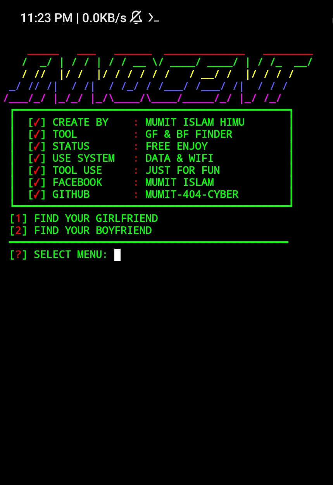

## COMMAND :

* `pkg update && pkg upgrade`

* `pkg install python`

* `pkg install git`

* `pip install requests`

* `pip install bs4`

* `rm -rf GF-BF-FINDER`

* `git clone https://github.com/MUMIT-404-CYBER/GF-BF-FINDER.git`

* `cd GF-BF-FINDER`

* `python GF-BF.py`

___This Tool is Free Enjoy Dear User.___ 

## SCREENSHOT :
 

